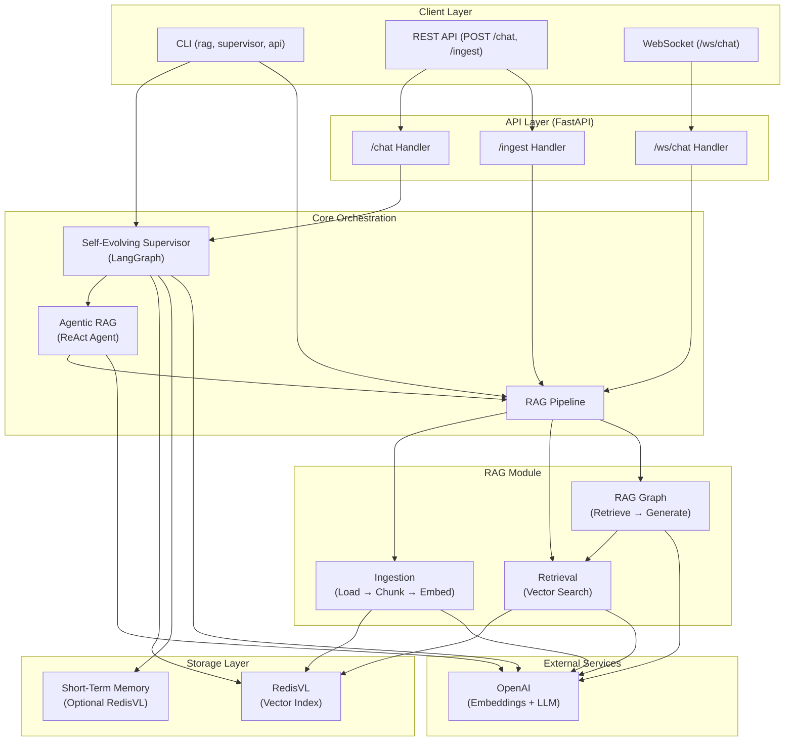
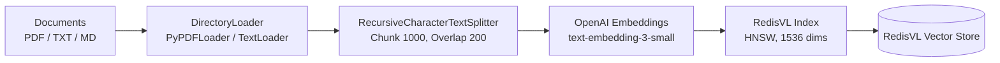
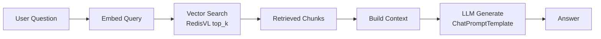
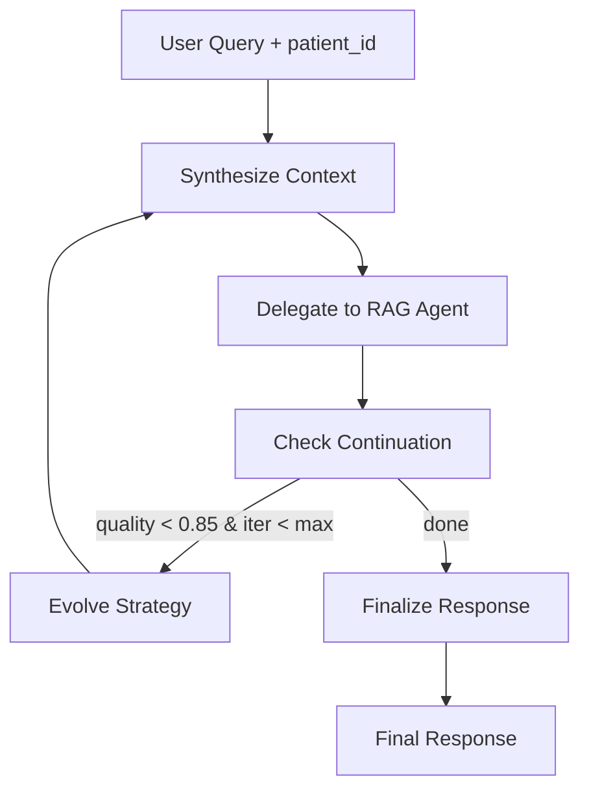
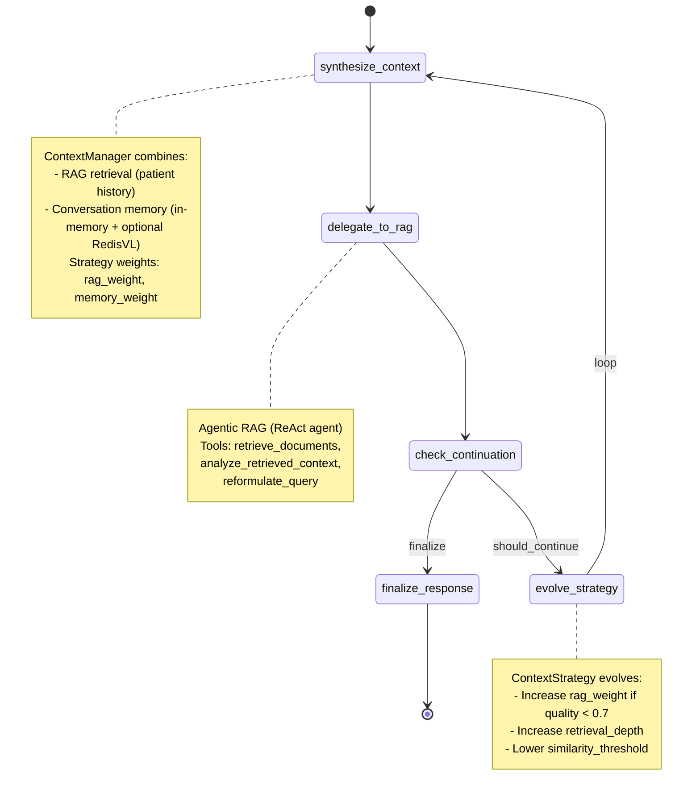
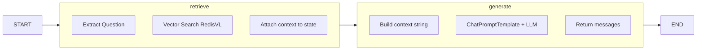
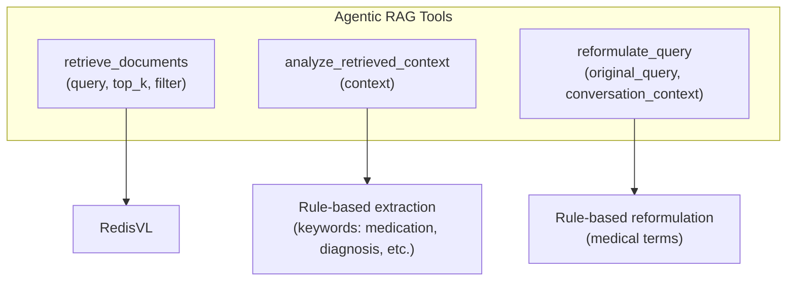

# ClinXplain

**RAG pipeline, agentic RAG, and self-evolving supervisor for medical Q&A.** Uses **Redis** (RedisVL), **LangChain**, **LangGraph**, and **OpenAI**.

---

## Table of Contents

- [Architecture Overview](#architecture-overview)
- [System Architecture Diagram](#system-architecture-diagram)
- [Component Architecture](#component-architecture)
- [Data Flow](#data-flow)
- [Supervisor Graph Flow](#supervisor-graph-flow)
- [RAG Pipeline Flow](#rag-pipeline-flow)
- [Package Structure](#package-structure)
- [Quick Start](#quick-start)
- [Configuration](#configuration)
- [API Reference](#api-reference)
- [RAG Evaluation](#rag-evaluation)

---

## Architecture Overview

ClinXplain is a multi-layer medical Q&A system built on three pillars:

1. **RAG Pipeline** — Document ingestion, vector retrieval (RedisVL), and answer generation (LangGraph).
2. **Agentic RAG** — A ReAct agent with retrieval, analysis, and query-reformulation tools.
3. **Self-Evolving Supervisor** — A LangGraph orchestrator that manages context strategy (RAG vs. memory weights), delegates to the agentic RAG sub-agent, and evolves its strategy based on response quality.

The system can be accessed via:
- **CLI** — `rag` (ingest/query/retrieve/eval) and `supervisor` commands
- **REST/WebSocket API** — FastAPI server for chat and document ingestion
- **Python API** — Direct imports for programmatic use

---

## System Architecture Diagram



---

## Component Architecture

```mermaid
flowchart LR
    subgraph src_clinxplain["src/clinxplain"]
        api["api.py\nFastAPI app"]
        agentic["agentic.py\nReAct Agent"]
        supervisor["supervisor.py\nLangGraph Supervisor"]

        subgraph rag["rag/"]
            config["config.py\nRAGConfig"]
            ingestion["ingestion.py\nLoad, Chunk, Embed"]
            retrieval["retrieval.py\nVector Search"]
            graph["graph.py\nRAG LangGraph"]
            pipeline["pipeline.py\nRAGPipeline"]
            weave_eval["weave_eval.py\nW&B Weave Eval"]
        end

        subgraph cli["cli/"]
            rag_cli["rag.py\ningest|query|retrieve|eval"]
            supervisor_cli["supervisor.py\n<query>"]
            api_cli["api.py\nuvicorn server"]
        end
    end

    api --> supervisor
    api --> pipeline
    supervisor --> agentic
    supervisor --> pipeline
    agentic --> retrieval
    pipeline --> ingestion
    pipeline --> retrieval
    pipeline --> graph
```

---

## Data Flow

### Document Ingestion Flow



### Query Flow (RAG Pipeline)



### Supervisor Query Flow



---

## Supervisor Graph Flow

The self-evolving supervisor uses a LangGraph `StateGraph` with conditional edges:



### Supervisor State (`AgentState`)

| Field | Type | Description |
|-------|------|-------------|
| `query` | str | User question |
| `patient_id` | str \| None | Optional patient scope for retrieval |
| `rag_results` | list[RetrievedDocument] | Documents from RAG |
| `conversation_history` | list[ConversationTurn] | Prior turns |
| `context_strategy` | ContextStrategy | RAG vs. memory weights, retrieval depth |
| `combined_context` | str | Synthesized context for RAG agent |
| `rag_response` | str | Response from agentic RAG |
| `sources_used` | list[str] | Sources cited |
| `current_iteration` | int | Iteration counter |
| `should_continue` | bool | Whether to evolve or finalize |
| `final_response` | str | Final output |
| `strategy_history` | list[ContextStrategy] | Evolution history |

---

## RAG Pipeline Flow

The RAG module uses a LangGraph `StateGraph`:



### RAG State (`RAGState`)

| Field | Type | Description |
|-------|------|-------------|
| `messages` | list[BaseMessage] | Chat history (add_messages reducer) |
| `context` | list[Document] | Retrieved documents |
| `question` | str | Current question |

---

## Agentic RAG Tools

The ReAct agent exposes three tools:



| Tool | Purpose |
|------|---------|
| `retrieve_documents` | Vector search over RedisVL; returns formatted chunk excerpts |
| `analyze_retrieved_context` | Extracts key facts (medications, diagnoses, labs) from context |
| `reformulate_query` | Reformulates vague queries with medical terms and context |

---

## Package Structure

```
src/clinxplain/
├── __init__.py          # RAGConfig, RAGPipeline, create_rag_agent, create_supervisor, query_medical_system
├── __main__.py          # Entry: python -m clinxplain → runs API
├── api.py               # FastAPI: /health, POST /chat, POST /ingest, WS /ws/chat
├── agentic.py           # ReAct agent with retrieve/analyze/reformulate tools
├── supervisor.py        # Self-evolving supervisor (LangGraph)
├── cli/
│   ├── rag.py           # rag ingest | query | retrieve | eval
│   ├── supervisor.py    # supervisor <query> [--patient-id ID]
│   └── api.py           # api [--host 0.0.0.0] [--port 8000]
└── rag/
    ├── config.py        # RAGConfig (Redis, embedding, chunking, retrieval)
    ├── ingestion.py     # Load documents, chunk, embed, index (RedisVL)
    ├── retrieval.py     # Vector search over RedisVL
    ├── graph.py         # LangGraph RAG: retrieve → generate
    ├── pipeline.py      # RAGPipeline high-level API
    ├── weave_eval.py    # W&B Weave tracing + evaluation
    └── schema.yaml      # RedisVL index schema reference
```

---

## Quick Start

### 1. Environment

```bash
cp .env.example .env
# Edit .env: REDIS_URL, OPENAI_API_KEY
```

### 2. Install

```bash
uv sync
```

### 3. CLI

```bash
# RAG: ingest, query, retrieve, or evaluate
uv run rag ingest docs/ [--glob "**/*.pdf"]
uv run rag query "What medications is this patient taking?" [--top-k 5]
uv run rag retrieve "search query" [--top-k 5]
uv run rag eval [--project your-team/rag-eval --parallelism 3]

# Supervisor: run medical query through self-evolving system
uv run supervisor "What medications is this patient taking?" [--patient-id patient_001]

# API server (see "How to run the API" below)
uv run api [--host 0.0.0.0] [--port 8000] [--reload]

# Chatbot UI (Streamlit): upload docs + chat via WebSocket
uv run streamlit run streamlit_app.py [--server.port 8501]
```

#### How to run the API

1. **Prerequisites:** Copy `.env.example` to `.env`, set `REDIS_URL` and `OPENAI_API_KEY`, then run `uv sync`.
2. **Start the server:**
   ```bash
   uv run api
   ```
   Default: listens on `http://0.0.0.0:8000` (all interfaces, port 8000).
3. **Optional flags:**
   - `--host <host>` — Bind address (default: `0.0.0.0`).
   - `--port <port>` — Port (default: `8000`).
   - `--reload` — Auto-reload on code changes (development only).
   ```bash
   uv run api --host 127.0.0.1 --port 8000 --reload
   ```
4. **Verify:** Open `http://localhost:8000/health` — should return `{"status":"ok"}`. Interactive API docs: `http://localhost:8000/docs` (Swagger UI).

### 4. Python API

```python
from clinxplain import RAGConfig, RAGPipeline, create_rag_agent, create_supervisor, query_medical_system

config = RAGConfig.from_env()
pipeline = RAGPipeline(config)
pipeline.ingest("docs/")
docs = pipeline.retrieve("search query", top_k=5)
answer = pipeline.query("Your question?")

# Agentic RAG (standalone or used by supervisor)
rag_agent = create_rag_agent(config)

# Self-evolving supervisor
result = await query_medical_system("Medical question?", patient_id="patient_001")
print(result["final_response"])
```

---

## Configuration

| Variable | Description |
|----------|-------------|
| `REDIS_URL` | Redis connection URL |
| `OPENAI_API_KEY` | OpenAI API key (embeddings + LLM) |
| `RAG_INDEX_NAME` | RedisVL index name (default: `rag_docs`) |
| `RAG_TOP_K` | Chunks to retrieve (default: 5) |
| `RAG_CACHE_TTL` | Redis LLM cache TTL in seconds (default: 3600); 0 = disable |
| `WEAVE_PROJECT` | W&B Weave project for eval (e.g. `your-team/rag-eval`) |
| `WANDB_API_KEY` | W&B API key (optional, for Weave) |

See `.env.example` for full list.

---

## API Reference

Base URL when running locally: `http://localhost:8000`. Interactive docs: **http://localhost:8000/docs**.

| Method / Type | Path | Description |
|---------------|------|-------------|
| GET | `/health` | Health check; returns `{"status":"ok"}` |
| POST | `/chat` | Chat (supervisor + RAG); JSON body with `message`, optional `patient_id`, `conversation_history` |
| POST | `/ingest` | Ingest documents into RAG; multipart form `files` (PDF, .txt, .md) |
| WebSocket | `/ws/chat` | Streaming chat; RAG retrieve + token-by-token LLM stream |

### REST Endpoints

#### GET `/health`

Health check for load balancers and readiness probes.

- **Response:** `200 OK`
- **Body:** `{ "status": "ok" }`

---

#### POST `/chat`

Chat with the medical Q&A system (self-evolving supervisor + RAG). Returns the assistant reply and updated conversation history.

- **Request:** JSON body
  - `message` (string, required) — User question.
  - `patient_id` (string, optional) — Patient ID for scoped retrieval.
  - `conversation_history` (array, optional) — Previous turns: `[{ "query": "...", "response": "..." }]`.
- **Response:** `200 OK`, JSON
  - `response` (string) — Assistant reply.
  - `conversation_history` (array) — Updated list of `{ "query", "response" }`.
  - `iterations` (number) — Supervisor iteration count.
  - `strategy_version` (number) — Context strategy version.
- **Errors:** `500` — Server error (e.g. missing env, Redis/LLM failure).

**Example:**

```bash
curl -X POST http://localhost:8000/chat \
  -H "Content-Type: application/json" \
  -d '{"message": "What medications is this patient on?", "patient_id": null, "conversation_history": null}'
```

---

#### POST `/ingest`

Ingest documents into the RAG index (RedisVL). Accepts multipart form-data with one or more files.

- **Request:** `multipart/form-data`
  - `files` (required) — One or more files; each part named `files`. Allowed types: `.pdf`, `.txt`, `.md`.
- **Response:** `200 OK`, JSON
  - `chunks_ingested` (number) — Number of chunks indexed.
  - `keys_count` (number) — Number of Redis keys written.
  - `files_received` (number) — Number of files accepted.
- **Errors:**
  - `400` — No files or no valid file types.
  - `500` — Server error (e.g. ingest failure).

**Example:**

```bash
curl -X POST http://localhost:8000/ingest \
  -F "files=@document1.pdf" \
  -F "files=@notes.txt"
```

### WebSocket `/ws/chat`

Real-time chat with **token-by-token LLM streaming** over a single WebSocket connection.

| Aspect | Details |
|--------|---------|
| **Path** | `ws://<host>:<port>/ws/chat` (e.g. `ws://localhost:8000/ws/chat`) |
| **Flow** | RAG retrieve (same config as pipeline) → build context → stream LLM tokens over the socket |
| **Note** | Uses a simplified RAG + streaming LLM path (not the full self-evolving supervisor) so responses can stream token-by-token. For full supervisor logic (strategy evolution, multi-iteration), use REST `POST /chat`. |

**Send (JSON, first message after connect):**

```json
{
  "message": "What medications is this patient on?",
  "patient_id": "patient_001",
  "conversation_history": [
    { "query": "Previous question", "response": "Previous answer" }
  ]
}
```

- `message` (required): User question. Aliased as `query` if `message` is missing.
- `patient_id` (optional): Scopes retrieval (e.g. "Patient patient_001: ...").
- `conversation_history` (optional): Array of `{ "query", "response" }` for multi-turn context (used when building the prompt; streaming reply is for the current `message` only).

**Receive (JSON messages):**

| `type` | Payload | When |
|--------|---------|------|
| `token` | `{ "type": "token", "content": "<one token or chunk>" }` | Each streamed LLM token/chunk |
| `done` | `{ "type": "done", "response": "<full text>", "conversation_history": [...] }` | After streaming finishes; includes full response and updated history |
| `error` | `{ "type": "error", "detail": "<message>" }` | On validation or server error (e.g. missing `message`, invalid JSON) |

**Minimal client example (browser):**

```javascript
const ws = new WebSocket("ws://localhost:8000/ws/chat");
ws.onopen = () => {
  ws.send(JSON.stringify({
    message: "What are the main findings?",
    patient_id: null,
    conversation_history: []
  }));
};
ws.onmessage = (e) => {
  const data = JSON.parse(e.data);
  if (data.type === "token") process.stdout.write(data.content);
  if (data.type === "done") console.log("\nFull response:", data.response);
  if (data.type === "error") console.error("Error:", data.detail);
};
```

Document ingestion remains REST only: use `POST /ingest` for uploading files.

---

## RAG Evaluation (W&B Weave)

- **Tracing:** Retrieval wrapped with `weave.op()` for observability.
- **RAGModel:** Weave `Model` with `predict(question)` → `{answer, context}`.
- **LLM Judge:** Context precision (RAGAS-style) scorer.
- **Optional RAGAS:** Faithfulness, answer relevancy (install `clinxplain[ragas]`).

```bash
uv run rag eval [--project your-team/rag-eval --parallelism 3]
```

```python
from clinxplain.rag.weave_eval import init_weave, RAGModel, run_evaluation

run_evaluation(project="your-team/rag-eval", parallelism=3)
```

---

## Redis MCP

If using Redis MCP in Cursor, the RAG pipeline uses the same Redis via `REDIS_URL`.

---

## Document Paths

- **`docs/`** — Default folder for ingest (created if missing).
- **`notebook/`** — Fallback (e.g. `notebook/66_10.pdf`).

---

## Dependencies

- **Core:** redisvl, langchain, langgraph, langchain-openai, pypdf, python-dotenv
- **API:** fastapi, uvicorn, python-multipart
- **Eval:** weave, wandb
- **Optional:** ragas (for RAGAS metrics)
